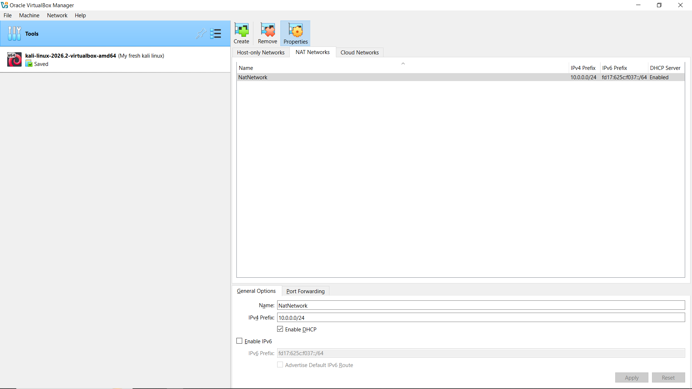
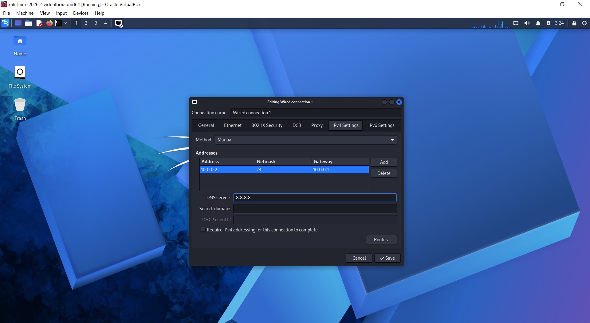

# Cybersecurity Hands-On Lab Setup

> Building a secure, isolated virtual environment for ethical hacking and defensive security training.

---

##  Project Overview

This project demonstrates the process of building a private virtual cybersecurity laboratory using **Oracle VM VirtualBox** and **Kali Linux**.

The lab provides a controlled environment for practicing cybersecurity and penetration-testing techniques without directly interacting with unauthorized real-world systems.

Inside this virtual lab, the following cybersecurity activities can be practiced:

* 🔍 Network Scanning
* 🕵️ Reconnaissance & Information Gathering
* 🔎 Vulnerability Assessment
* 🌐 Network & Traffic Analysis
* 🛡️ Web Security Testing
* ⚔️ Ethical Exploitation in a Controlled Environment
* 🧰 Cybersecurity Tool Testing

The environment uses a custom **NAT Network** that allows multiple virtual machines to communicate with each other while providing controlled outbound internet connectivity.

---

##  Project Objectives

The primary objectives of this project are:

* Deploy and configure **Oracle VM VirtualBox** as the virtualization platform.
* Import and configure **Kali Linux** as the primary security operating system.
* Establish a custom **NAT Network** for the cybersecurity lab.
* Configure network connectivity for the Kali Linux VM.
* Assign a predictable static IPv4 address to the Kali Linux VM.
* Verify gateway, internet, and DNS connectivity.
* Create a clean VirtualBox snapshot for system recovery.
* Document the complete laboratory configuration.
* Prepare the environment for future cybersecurity and penetration-testing labs.

---

## 🛡️ Why Build This Lab?

A dedicated cybersecurity laboratory provides a controlled environment where security tools and techniques can be practiced safely.

This lab can be used to practice:

* **Information Gathering** – Identifying systems and services within the lab network.
* **Port Discovery** – Identifying open ports and exposed services.
* **Vulnerability Assessment** – Identifying potential security weaknesses.
* **Traffic Analysis** – Inspecting network communication.
* **Web Security Testing** – Practicing web application security testing.
* **Ethical Exploitation** – Understanding exploitation techniques in an authorized environment.
* **Security Tool Testing** – Learning and testing different cybersecurity tools.

---

## ⚠️ Safety Warning

> **This laboratory must only be used with systems that you own or have explicit authorization to test.**
>
> Never scan, exploit, or attack systems, networks, applications, or devices without permission.

---

# 🏗️ Lab Architecture

The following diagram represents the virtual cybersecurity laboratory architecture, including the host system, VirtualBox hypervisor, Kali Linux VM, and private laboratory network.

### Network Architecture


---

# ⚙️ Environment Profile

## 📋 System Configuration

| Component                 | Configuration            |
| ------------------------- | ------------------------ |
| Host Operating System     | Windows 10               |
| Host Memory               | 8 GB RAM                 |
| Processor                 | Intel Core i5            |
| Hypervisor                | Oracle VM VirtualBox 7.1 |
| Security Operating System | Kali Linux 2026          |
| Kali VM Memory            | 2048 MB (2 GB)           |
| Network Type              | NAT Network              |
| Network Name              | `NatNetwork`             |
| Subnet                    | `10.0.0.0/24`            |
| Kali Linux IP             | `10.0.0.2/24`            |
| Default Gateway           | `10.0.0.1`               |
| DNS Server                | `8.8.8.8`                |
| Available Host Range      | `10.0.0.3 – 10.0.0.254`  |

> **Note:** If DHCP is enabled on the NAT Network, ensure that the static IP `10.0.0.2` does not overlap with the DHCP allocation range.

---

# 🛠️ Lab Implementation

## Phase 1: Extract the Kali Linux Package

### Purpose

Install and use **7-Zip** to extract the compressed Kali Linux virtual machine package.

### Action

The `.7z` archive containing the pre-configured Kali Linux virtual appliance was extracted using 7-Zip.

---

## Phase 2: Install Oracle VM VirtualBox

### Purpose

Set up the virtualization platform used to create and manage the cybersecurity laboratory.

### Action

Oracle VM VirtualBox was installed on the Windows host system using the standard installation process.

---

# Phase 3: Create the Custom NAT Network

### Purpose

Create a private virtual network that allows laboratory virtual machines to communicate with each other while providing controlled outbound internet connectivity.

### Network Configuration

* **Network Name:** `NatNetwork`
* **Network Address:** `10.0.0.0/24`
* **DHCP:** Enabled
* **IPv6:** Disabled

### VirtualBox NAT Network Configuration



### Network Settings

The NAT Network was configured through the VirtualBox network settings.

A NAT Network differs from standard NAT because multiple virtual machines connected to the same NAT Network can communicate with one another.

---

# Phase 4: Import and Configure Kali Linux

### System Source

The official pre-built Kali Linux virtual appliance was downloaded from the Kali Linux website and imported into VirtualBox.

### Network Adapter Configuration

The Kali Linux VM was configured with the following network settings:

| Setting      | Configuration                       |
| ------------ | ----------------------------------- |
| Adapter      | Adapter 1                           |
| Attached To  | NAT Network                         |
| Network Name | `NatNetwork`                        |
| Adapter Type | Intel PRO/1000 MT Desktop (82540EM) |

### Kali Linux VM Configuration


### System Resources

* **Allocated RAM:** 2048 MB (2 GB)

---

# 🌐 Network Architecture

The custom NAT Network was selected for two main reasons.

## 1. Inter-VM Communication

Multiple virtual machines connected to the same NAT Network can communicate with one another, making it suitable for creating attacker and target machines inside the cybersecurity lab.

## 2. Controlled Internet Connectivity

The NAT Network provides outbound internet connectivity, which can be useful for activities such as updating Kali Linux and installing security tools.

> **Important:** NAT Network provides a degree of network isolation, but it should not be considered a complete security boundary for highly sensitive environments.

---

# Phase 5: Configure a Static IPv4 Address

The Kali Linux network configuration was adjusted to use a predictable IPv4 address within the laboratory subnet.

## 📝 Assigned Network Configuration

| Network Property  | Configuration   |
| ----------------- | --------------- |
| Static IP Address | `10.0.0.2`      |
| Subnet Mask       | `255.255.255.0` |
| Default Gateway   | `10.0.0.1`      |
| DNS Server        | `8.8.8.8`       |

### Kali Linux IPv4 Configuration



---

## 💡 Why Use a Static IP?

Using a predictable IP address provides several benefits in a cybersecurity laboratory:

1. **Simplified Documentation**
   Makes lab configurations and testing notes easier to maintain.

2. **Reliable Testing**
   Security tools can consistently target the same laboratory machine.

3. **Easier Troubleshooting**
   A fixed address makes network troubleshooting and configuration verification easier.

4. **Reliable Inter-VM Communication**
   Other authorized laboratory machines can consistently communicate with the Kali Linux VM.

---

# 📸 Phase 6: Create a VirtualBox Snapshot

After completing the initial system and network configuration, a clean VirtualBox snapshot was created.

### Snapshot Name

`Clean Kali - Network Setup`

### 💡 Why Create a Snapshot?

The snapshot provides a clean recovery point for the cybersecurity laboratory.

If a future experiment changes the system configuration or causes problems, the Kali Linux VM can be restored to the clean baseline.

This is especially useful when performing penetration-testing exercises, installing new tools, or experimenting with security configurations.

---

# 🧪 Environment Testing & Verification

After completing the configuration, several commands were used to verify the network configuration and security-tool installation.

## 📊 Verification Test Log

| Diagnostic Objective       | Command                     | Expected Result                                 |
| -------------------------- | --------------------------- | ----------------------------------------------- |
| Check Local IP Address     | `ip a`                      | Kali displays `10.0.0.2`                        |
| Test Router Gateway        | `ping 10.0.0.1`             | Successful replies                              |
| Test Internet Connectivity | `ping 8.8.8.8`              | Successful replies                              |
| Test DNS Resolution        | `nslookup networkwalks.com` | Domain resolves successfully                    |
| Verify Nmap Installation   | `nmap --version`            | Installed Nmap version is displayed             |
| Verify Snapshot Recovery   | Restore snapshot → `ip a`   | Kali returns to the clean network configuration |

> **Note:** ICMP/ping responses may be disabled by some systems. A failed ping does not always mean that network connectivity is unavailable.

---

# 🎓 Key Concepts Learned

## 1. NAT vs. NAT Network

Learned the difference between standard **NAT** and **NAT Network** configurations.

A NAT Network allows multiple virtual machines connected to the same virtual network to communicate with one another while providing outbound network access.

---

## 2. Virtualization & Network Topology

Gained practical experience with:

* Virtual machines
* Virtual network adapters
* NAT Networks
* Network isolation
* Virtual network topology
* VirtualBox configuration

---

## 3. IPv4 Network Configuration

Practiced configuring:

* IPv4 addresses
* Subnet masks
* Default gateways
* DNS servers
* Static network configuration

The laboratory uses the private IPv4 subnet:

```text
10.0.0.0/24
```

---

## 4. VM Snapshots & Recovery

Learned how VirtualBox snapshots can be used to create a clean baseline before performing security experiments.

Snapshots make it easier to recover the virtual machine after configuration changes or unsuccessful experiments.

---

## 5. Security Lab Documentation

Developed practical documentation skills by recording:

* System specifications
* Network configuration
* VM settings
* Commands used for verification
* Lab architecture
* Recovery procedures
* Security testing activities

Clear technical documentation is an important skill in professional cybersecurity and penetration testing.

---

# 🧰 Tools & Technologies Used

| Tool / Technology             | Purpose                                                   |
| ----------------------------- | --------------------------------------------------------- |
| 🐧 **Kali Linux**             | Security testing and penetration-testing operating system |
| 🖥️ **Oracle VM VirtualBox**  | Virtualization platform                                   |
| 📦 **7-Zip**                  | Virtual appliance extraction                              |
| 🔍 **Nmap**                   | Network and service scanning                              |
| 🌐 **Linux Networking Tools** | Network configuration and troubleshooting                 |
| 🔗 **VirtualBox NAT Network** | Private virtual network communication                     |

---

# 🔗 Reference Tools & Downloads

The following official sources were used for the software required to build the laboratory:

* **7-Zip** – File compression and extraction utility
* **Oracle VM VirtualBox** – Virtualization platform
* **Kali Linux** – Security-focused Linux distribution

---

# 👤 Project Creator

## Shahabas Usman AK

**Cybersecurity Professional B083**

### 🔗 Connect With Me

* 💼 **LinkedIn:** [Shahabas AK](https://www.linkedin.com/in/shahabas-ak/)
* 💻 **GitHub:** [Shahabas4k](https://github.com/Shahabas4k)

---

# 📌 Project Information

| Category   | Details                                                |
| ---------- | ------------------------------------------------------ |
| Program    | Cybersecurity Training Program by Networkwalks         |
| Timeline   | Week 01 – Practical Application                        |
| Assignment | Secure Cybersecurity & Penetration-Testing Environment |
| Platform   | GitHub Repository                                      |

---

# 📚 Skills Demonstrated

* 🐧 Kali Linux
* 🖥️ VirtualBox
* 🌐 IPv4 Networking
* 🔗 NAT Networking
* 🔍 Nmap
* 🛠️ Linux Network Configuration
* 🧪 Security Testing Fundamentals
* 🔐 Cybersecurity Lab Setup
* 📋 Technical Documentation
* 🖥️ Virtual Machine Management

---

# ⚖️ Disclaimer

This project is created for **educational purposes and authorized security testing only**.

All scanning, vulnerability assessment, and penetration-testing activities should be performed only against systems that you own or have explicit permission to test.

---

⭐ **If you find this project useful, consider giving the repository a star!**

