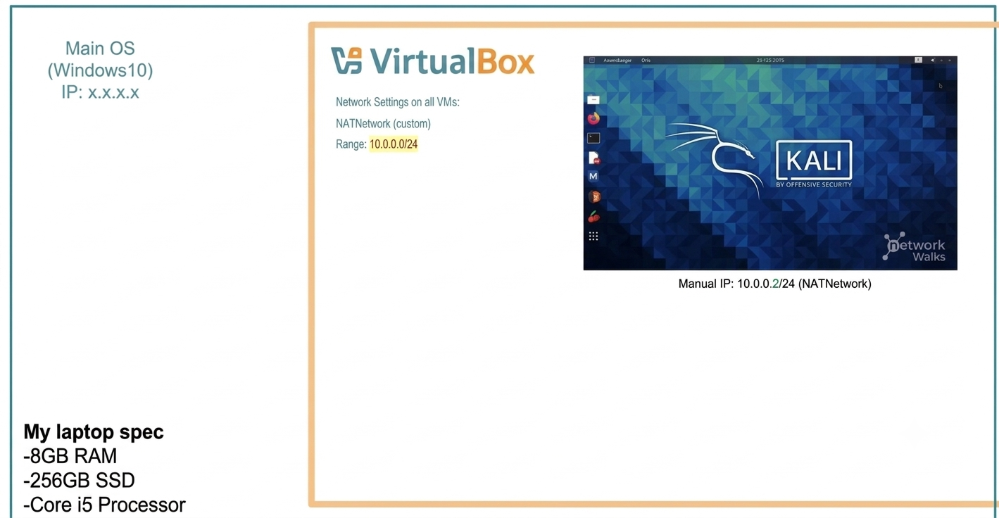

# Cybersecurity Hands-On Lab Setup

> Building a secure, isolated sandbox environment for ethical hacking and defensive security training.

---

## 📌 Project Overview

This project walks through the process of building a private, virtual cybersecurity laboratory from scratch. By using VirtualBox alongside Kali Linux, this setup provides a safe, contained space to practice vital security skills. 

Inside this isolated network, you can safely perform core cybersecurity tasks like:
* Network Scanning to find active devices.
* Reconnaissance to gather vital system data.
* Vulnerability Assessments to scan for weak spots.
* Security Testing to practice ethical hacking methods over and over without risking real-world systems.

The entire environment runs on a customized, private network layout. This makes it incredibly easy to attach more target machines or vulnerable systems later on as your testing needs grow.

---

## 🎯 Core Objectives

The primary goals accomplished in this project are:
* Deploy and Configure VirtualBox as the main virtualization manager.
* Import and Initialize Kali Linux to serve as the primary security operating system.
* Establish a Custom NAT Network to guarantee secure, isolated communication between lab machines.
* * Set up network access for the Kali Linux machine.
* Give a permanent IP address to your Kali Linux virtual machine (VM).
* Test the internet connection and check that DNS (website names) works correctly.
* Save a clean system backup (snapshot) so you can easily reset the lab if anything breaks.
* Write clear notes on how the whole environment was built.
* Get the system ready to handle more advanced security labs in the future.

---

## 🛡️ Why We Build This Lab

This lab gives you a secure, locked-down digital workspace. It is a completely safe zone built for hands-on learning and approved security testing. 

You can use this lab setup to practice things like:
* Information Gathering: Finding out what systems are running on a network.
* Port Discovery: Checking which digital doors or entry points are open.
* Weakness Hunting: Finding software gaps that need to be patched or fixed.
* Traffic Inspection: Looking closely at data moving across a network.
* Web Security Testing: Checking website code for flaws.
* Ethical Exploitation: Learning how hackers break into systems so you can defend against them.
* Tool Testing: Trying out different cybersecurity software programs to see how they work.

---

## ⚠️ Crucial Safety Warning

Important Note: This laboratory setup must only be used to interact with machines that you legally own or have written permission to test. Never use these tools or methods to scan or attack computers that do not belong to you!
---

## 🏗️ Lab Architecture

Below is the network topology map designed for this virtual environment. It outlines the master host system, the hypervisor engine, and the isolated target subnet layout.

<!-- Replace the text below with your actual image path or URL -->

## ⚙️ Environment Profile & Settings

Below is the detailed configuration breakdown for the primary virtualization engine, core operating systems, and network properties used to establish this training lab.

!Lab Configuration Table (http://img2.png/)

### 📋 System Parameter Matrix

| 🛠️ Infrastructure Component | 🔧 Assigned Specification / Value |
| :--- | :--- |
| Host Operating System | Windows 10 |
| Allocated Host Memory | 8 GB RAM |
| Processor Profile | Intel Core i5 |
| Hypervisor Software | Oracle VM VirtualBox 7.1 |
| Primary Security OS | Kali Linux 2026 |
| Virtual Machine Memory | 2048 MB RAM |
| Network Type Deployment | Isolated NAT Network |
| Subnet Block | 10.0.0.0/24 |
| Kali Linux Local IP | 10.0.0.2/24 (Static) |
| Default Router Gateway | 10.0.0.1 |
| Domain Name Server (DNS) | 8.8.8.8 |
| Available Subnet Range | 10.0.0.3 – 10.0.0.254 |
---

## 🛠️ Step-by-Step Lab Implementation

Follow these structured phases to deploy and prepare the virtual cybersecurity laboratory.

### Phase 1: Extract Tools with 7-Zip
* Purpose: Installed the 7-Zip utility to handle file decompression.
* Action: Used this utility to smoothly extract the compressed .7z archive containing the pre-configured Kali Linux virtual machine package.

### Phase 2: Deploy Oracle VM VirtualBox
* Purpose: Set up the main virtualization engine (hypervisor).
* Action: Completed the standard system installation of VirtualBox to create, host, and manage virtual instances on the base Windows device.

### Phase 3: Provision the Custom NAT Network
* Purpose: Establish a secure, isolated communications network link for all guest virtual environments.
* Action: Built a distinct private network pool directly inside the VirtualBox global preferences panel.

#### 🌐 Network Settings Details:
* Network Identifier Profile: NatNetwork
* Subnet Block Allocation: 10.0.0.0/24
* Dynamic IP Assignment (DHCP): Enabled
* IPv6 Support Protocol: Disabled
* 
### Phase 4: Import and Prepare the Kali Linux Machine
* System Source: Downloaded the official pre-built virtual appliance package directly from the Kali Linux distribution site.
* Deployment: Imported the machine image straight into VirtualBox to create the virtual system environment.

#### 🎛️ Network Interface Hardware Profile
The virtual network device profile was updated with these active settings to lock it down to the private subnet:

* Hardware Slot: Adapter 1
* Connection Profile: Bound directly to NAT Network
* Target Network Profile Name: NatNetwork
* Emulated Device Model: Intel PRO/1000 MT Desktop (82540EM)

#### 🧠 System Resource Profile
* Allocated System RAM: 2048 MB (2 GB)

---

### 🛡️ Core Infrastructure Network Analysis
We selected a customized NAT Network setup for this sandbox environment for two main technical reasons:
1. Isolated Inter-VM Data Channels: Allows multiple local virtual machines (both testing nodes and target nodes) to talk directly to each other securely inside the private lab space.
2. Controlled Internet Access Channels: Provides outbound internet connectivity to the systems so you can safely run software package updates without exposing the host network interface directly to danger

### Phase 5: Establish Static Network Settings inside Kali Linux

* Data Sharing Bridge: Configured a Shared Folder resource within VirtualBox settings. This provides a direct, secure pipeline to transfer tools and files between the base Windows host machine and the target Kali Linux VM.
* Network Assignment: Adjusted the internal settings of the Kali operating system to run on a fixed, predictable IPv4 network profile.

#### 📝 Assigned Network Profile Settings

| ⚙️ Network Property | 🔑 Configuration Parameter Value |
| :--- | :--- |
| Static IP Address | 10.0.0.2 |
| Subnet Mask | 255.255.255.0 |
| Default Router Gateway | 10.0.0.1 |
| Preferred DNS Server | 8.8.8.8 |

---

### 💡 Why We Use a Permanent IP Setup
Locking down the Kali Linux system to a permanent (static) IP address provides two key benefits for our training exercises:
1. Simplified Lab Notes: It makes tracking and documenting target attacks, network scanning outputs, and lab setups much easier.
2. Reliable Tool Links: It ensures that other target machines added to this network can always reach the attacker station at the exact same location without unexpected address drops or updates.

---

## 📸 Step 6: Capture a Fresh System Snapshot

* Action: Once the initial configuration was complete, a clean state system backup (snapshot) was captured directly within Oracle VM VirtualBox.
* Snapshot Label: Clean Kali - Network Setup

### 💡 Why We Save a System Snapshot
The snapshot serves as the clean baseline for our security laboratory. If a future hacking exercise breaks the system files or damages the network configuration, the virtual machine can be rolled back to this exact safe baseline state in just a few clicks.

---

## 🧪 Environment Testing & Verification

To confirm that the isolated sandbox laboratory was configured correctly, the following command line diagnostics were performed directly from the Kali Linux terminal terminal.

### 📊 Verification Test Log

| 📁 Diagnostic Objective | 💻 Executed Terminal Command | 🎯 Expected System Output |
| :--- | :--- | :--- |
| Check Local IP Address | ip a | Confirm the interface displays 10.0.0.2 |
| Test Router Gateway Link | ping 10.0.0.1 | Receive continuous successful data replies |
| Test Internet Access Connection | ping 8.8.8.8 | Receive continuous successful data replies |
| Test Domain Resolution Services | nslookup networkwalks.com | The domain target successfully resolves to an IP |
| Verify Security Tool Installation | nmap --version | The system displays the current active Nmap software build version |
| Verify Restore Points | Restore baseline snapshot, then rerun ip a | Confirm the machine recovers the static network state seamlessly |

---

## 🎓 Key Takeaways & Core Concepts Learned

Completing this hands-on lab environment helped build a strong foundational understanding of virtualized network infrastructure and systems security. 

Here are the key technical concepts gathered throughout this exercise:

### 1. Demystifying NAT vs. Custom NAT Networks
* Standard NAT vs. NAT Network: Learned that these two styles of network setups do entirely different jobs.
* Lab Environment Benefits: A custom NAT Network lets multiple client virtual machines easily talk directly with one another while safely routing outward web traffic through a single interface. This structure makes it perfect for building complex multi-system cybersecurity labs.

### 2. Mastering Virtualization & Network Topologies
* Virtual Adapter Controls: Gained practical experience choosing and tuning system hardware bridges inside VirtualBox.
* System Isolation Boundaries: Discovered how changes made to software adapter options directly impact how guest operating systems communicate across private boundaries.

### 3. Practical IPv4 Network Configuration
* Manual Parameter Controls: Mastered manual network deployment by adjusting specific subnets, custom subnet masks, network gateways, and active DNS resolution paths inside a live Linux terminal environment.
* Predictable Documentation Blocks: Learned how vital consistent static configuration setups are to ensure clean logging metrics throughout ongoing scanning and penetration operations.

### 4. Resilient Environment Operations via VM Snapshots
* Establishing System Baselines: Realized the critical importance of preserving a clean state system image before carrying out complex testing arrays.
* Risk Management Mitigation: Understood how capture points can instantly undo destructive changes or unexpected tool failures by cleanly resetting the environment back to its stable state.

### 5. Professional Documentation Practices
* Operational Logging: Realized that tracking command histories, capturing specific interface setups, and recording errors are foundational skills for any professional security engineer.

---

## 🔗 Reference Tools & Downloads

These official distribution channels were used to acquire the safe software packages needed to build this lab:
* 7-Zip Extraction Tool: 7-Zip Official Downloads (https://7-zip.org/)
* Hypervisor Platform: Oracle VM VirtualBox Download Center (https://virtualbox.org/)
* Security Operating System: Kali Linux Images Portal (https://kali.org/)

---

## 👥 Project Creator

* Name: [Shahabas usman ak]
* Cybersecurity Professional B083
* LinkedIn:** [https://www.linkedin.com](https://in/shahabas-ak)
  
---

## 📌 Project Information

* Program Track: Cybersecurity Training Program by Networkwalks
* Timeline Schedule: Week 01 Practical Application
* Assignment Focus: Construction of a Secure Cybersecurity & Pentesting Environment
* Platform Delivery: Personal Repository Tracking Documentation
